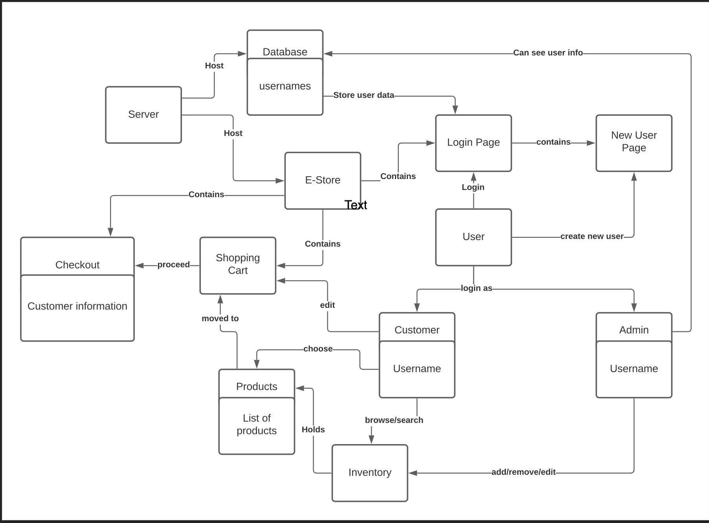

# PROJECT Design Documentation

> _The following template provides the headings for your Design
> Documentation.  As you edit each section make sure you remove these
> commentary 'blockquotes'; the lines that start with a > character
> and appear in the generated PDF in italics._

## Team Information
* Team name: AutoPets Team C
* Team members
  * Brian Lin
  * Alan Wang
  * Tyrone Tha
  * Diego Avila

## Executive Summary

Create an E-Store for variety of fruits. Our team used
Angular for the development of the store. The initial page that a 
User is greeted with is the login page. Users are able to login using 
a specified user or they are able to create a new user with a unique name. Admins are 
able to login using the same page with a unique admin username.
There is also a dashboard where the user is able to search for products and
view the most popular products. Admins have the option to view inventory, this takes them
to a different page where they are able to manipulate the inventory. Once the user searches for a product
they are taken to the product detail page where the user is able to add the product to their shopping cart.

### Purpose
> _Create an Estore where users are able to buy fruits. Users are able to
> search through a variety of fruits. The most frequented fruits are also displayed 
> on the main page for User convenience._
### Glossary and Acronyms
> _Provide a table of terms and acronyms._

| Term | Definition |
|------|------------|
| SPA | Single Page |

## Requirements

This section describes the features of the application.

- Customer can see list of products
- Customer can search for a product
- Customer can add/remove an item to their shopping cart
- Customer can proceed to check out their items for purchase
- Customers and Admins can login
- Admins can edit the inventory (add/remove)
- Users can view all of the products (dashboard)

### Definition of MVP
> _Minimal Authentication: A user(Customer or Admin) is able to login and out of the application.
> An admin logs in using the special admin credential. Customer Functionality: A customer is able to search
> for a product, add and remove from shopping cart. E-Store Owner Functionality:
> An e-store owner can add, remove, and edit the products in the inventory._ 

### MVP Features
- Minimal Authentication for customer/e-store owner login & logout
  - The server will (admittedly insecurely) trust the browser of who the user is. A simple username to login is all that is minimally required. Assume a user logging in as admin is the e-store owner.
  - You are not expected to do full credential and session management, although the system will look different depending on who is logged in. Obviously this isn't how things are done in real life, but let's sidestep that complexity for this class.
- Customer functionality
  - Customer can see list of products
  - Customer can search for a product
  - Customer can add/remove an item to their shopping cart
  - Customer can proceed to check out their items for purchase
- Inventory Management
  - E-Store owners can add, remove and edit the data on the inventory
- Data Persistence
  - Your system must save everything to files such that the next user will see a change in the inventory based on the previous user's actions. So if a customer had something in their shopping cart and logged out, they should see the same items in their cart when they log back in.
  - Ordinarily, we would want to use a database for this - but this semester our system will not reach a complexity that requires a database. You learned basic file I/O in your programming courses, so utilize what you know from there.
- Your 10% feature
  - Cost of the item
  - Summary Page
### Roadmap of Enhancements
- Customers are able to search and select products
- Customers and Admins have different visibility of the website
- Admins can manipulate inventory
- 10% features
## Application Domain

This section describes the application domain.

> _Provide a high-level overview of the domain for this application. You
> can discuss the more important domain entities and their relationship
> to each other._

## Architecture and Design

This section describes the application architecture.

### Summary

The following Tiers/Layers model shows a high-level view of the webapp's architecture.

The e-store web application, is built using the Model–View–ViewModel (MVVM) architecture pattern. 

The Model stores the application data objects including any functionality to provide persistance. 

The View is the client-side SPA built with Angular utilizing HTML, CSS and TypeScript. The ViewModel provides RESTful APIs to the client (View) as well as any logic required to manipulate the data objects from the Model.

Both the ViewModel and Model are built using Java and Spring Framework. Details of the components within these tiers are supplied below.

### Overview of User Interface

This section describes the web interface flow; this is how the user views and interacts
with the e-store application.

> _The user is able to navigate from the login screen to the dashboard to the checkout/confirmation
> page. Each product has a details page which has a button that enables the customer to add to their cart._

### View Tier
> _Provide a summary of the View Tier UI of your architecture.
> Describe the types of components in the tier and describe their
> responsibilities.  This should be a narrative description, i.e. it has
> a flow or "story line" that the reader can follow._

> _There is an admin view that has access to the inventory details as well as the ability to manipulate products.
> There is also a Customer page that allows customers to add products from the inventory into their shopping cart._

### ViewModel Tier
> _Provide a summary of this tier of your architecture. This
> section will follow the same instructions that are given for the View
> Tier above._

> _At appropriate places as part of this narrative provide one or more
> static models (UML class diagrams) with some details such as critical attributes and methods._

### Model Tier
> _Provide a summary of this tier of your architecture. This
> section will follow the same instructions that are given for the View
> Tier above._

> _At appropriate places as part of this narrative provide one or more
> static models (UML class diagrams) with some details such as critical attributes and methods._

### Static Code Analysis/Design Improvements
> _Discuss design improvements that you would make if the project were
> to continue. These improvement should be based on your direct
> analysis of where there are problems in the code base which could be
> addressed with design changes, and describe those suggested design
> improvements._

> _With the results from the Static Code Analysis exercise, 
> discuss the resulting issues/metrics measurements along with your analysis
> and recommendations for further improvements. Where relevant, include 
> screenshots from the tool and/or corresponding source code that was flagged._

## Testing
> _This section will provide information about the testing performed
> and the results of the testing._

### Acceptance Testing
> _Report on the number of user stories that have passed all their
> acceptance criteria tests, the number that have some acceptance
> criteria tests failing, and the number of user stories that
> have not had any testing yet. Highlight the issues found during
> acceptance testing and if there are any concerns._
> We were able to test all of our acceptance tests with success. The only
> tests we have yet to do is that off the front-end.

### Unit Testing and Code Coverage
> _Discuss your unit testing strategy. Report on the code coverage
> achieved from unit testing of the code base. Discuss the team's
> coverage targets, why you selected those values, and how well your
> code coverage met your targets. If there are any anomalies, discuss
> those._
> The unit testing strategy we did was writing part of the code and testing.
> Therefore we used a incremental kind of style because we basically
> write a bit of code, test it, then write more. 
